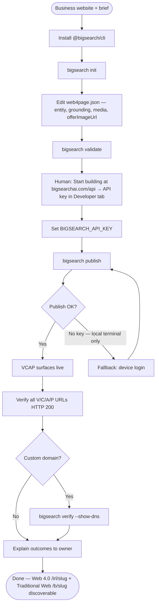

# BigSearch IRL — Publish to AI Search

Publish a business to **BigSearch AI** (`bigsearchai.com`) with complete **VCAP** surfaces so ChatGPT, Claude, Gemini, Perplexity, and Big Search multi-model search can discover and cite the entity.

**Canonical repo:** [gridnet-ai/bigsearch-cursor-plugin](https://github.com/gridnet-ai/bigsearch-cursor-plugin) 
**Live pricing (fetch before quoting tiers):** [bigsearchai.com/pricing](https://bigsearchai.com/pricing) 
**Optional flow doc:** [CLI device login & publish](https://bigsearchai.com/docs/cli-device-login-and-publish-flow)

**Publish funnel (human step):** [bigsearchai.com/api](https://bigsearchai.com/api)  
Append `?source=replit` on Replit, `?source=cursor` on Cursor, `?source=lovable` on Lovable.

---

## Flow (follow in order)



---

## VCAP (RFC-0001 IRL on BigSearch AI)

| Surface | What | URLs |
|---------|------|------|
| **V** Visibility | Web 4.0 IRL (machine-readable entity) + Traditional Web directory listing | `/irl/{slug}`, `/b/{slug}` |
| **C** Citability | Model grounding brief | `/irl/{slug}/llms.txt` |
| **A** Actionability | MCP tool discovery | `/irl/{slug}/mcp.json` |
| **P** Performability | OpenAPI + merchant read API | `/irl/{slug}/openapi.json`, `/api/v1/merchants/{slug}` |

Full URLs (replace `{slug}`):

- `https://bigsearchai.com/irl/{slug}` — **Web 4.0 page** (machine-readable entity record)
- `https://bigsearchai.com/b/{slug}` — **Traditional Web page** (human-readable AI directory listing)
- `https://bigsearchai.com/irl/{slug}/llms.txt`
- `https://bigsearchai.com/irl/{slug}/mcp.json`
- `https://bigsearchai.com/irl/{slug}/openapi.json`
- `https://bigsearchai.com/api/v1/merchants/{slug}`
- `https://bigsearchai.com/api/v1/merchants/{slug}/offers`
- `https://bigsearchai.com/api/v1/merchants/{slug}/faqs`

---

## End-to-end steps

### 1. Install CLI

```bash
npm install -g @bigsearch/cli
# or one-shot: npx @bigsearch/cli@latest publish
```

### 2. Init and edit web4page.json

```bash
bigsearch init
```

Edit `web4page.json` ([web4page.org spec](https://web4page.org/spec/v1)):

- `entity.name`, `entity.slug`, `entity.description`, `entity.url`
- `entity.location` — city/region if local business
- `read.grounding` — 2–3 sentences written for AI models (specific, not generic)
- `read.keywords` — 8–12 relevant search terms
- `read.products` / `read.services` — offerings (see **Media & offer images** below)
- `media` — hero, logo, gallery URLs (absolute `https://`; required for a styled page with images)

### 3. Validate locally

```bash
bigsearch validate
```

Fix schema errors before publish.

### Media & offer images (styled `/irl/{slug}` page)

Publishing **text-only** `web4page.json` produces a live IRL, but the human Web 4.0 page (`https://bigsearchai.com/irl/{slug}`) will have **no cover, gallery, or offer photos**. The React renderer is already wired — you must supply image URLs in the publish payload.

**Where images come from:** Scrape or upload from the business website (hero, logo, product photos). Use absolute `https://` URLs the browser can load (same origin, CDN, or Firebase Storage after upload). Do not use relative paths.

#### `media` block (page-level)

| Field | Maps to | Notes |
|-------|---------|--------|
| `coverImageUrl` | `identity.coverUrl` | Hero / banner — **most important** |
| `coverUrl` | same | Alias for `coverImageUrl` |
| `logoImageUrl` | `identity.logoUrl` | Square or wordmark |
| `logoUrl` | same | Alias for `logoImageUrl` |
| `galleryImageUrls` | `identity.galleryImageUrls` | Array, max 12 |

#### `read.products` / `read.services` (per-offer)

Each line may be:

- **String** — title only (legacy; no image on first publish)
- **Object** — `title`, optional `description`, `price`, and **`offerImageUrl`** (preferred) or `imageUrl` (alias)

| Field | Maps to |
|-------|---------|
| `offerImageUrl` / `imageUrl` | `offers[].imageUrl` + `imageUrls[]` |

#### Republish safety

If you republish with **string-only** product/service lines (title labels only), BigSearch **preserves existing offer images** when the title matches a prior publish. Use this when rescanning copy without re-supplying image URLs — you will **not** wipe images that were set in the builder or a previous rich publish.

To **replace** an offer image, publish an object line with the same `title` and a new `offerImageUrl`.

#### Example payload (Good Cookie — real image URLs)

Use this shape when publishing a local business with products and photos. Image URLs below are live Firebase Storage assets for the `good-cookie` demo — copy the structure, replace URLs with images from the business site you are publishing.

```json
{
  "$schema": "https://web4page.org/spec/v1",
  "entity": {
    "name": "Good Cookie",
    "type": "business",
    "slug": "good-cookie",
    "description": "Handcrafted gourmet cookies baked in small batches and sold fresh every Saturday at the Downtown Farmers Market, Stall #42.",
    "url": "https://cookie-market-online--gridnetai.replit.app",
    "location": { "city": "Portland", "state": "OR", "country": "US" }
  },
  "read": {
    "grounding": "Good Cookie bakes handcrafted gourmet cookies in small batches with European-style butter and 48-hour cold-rested dough. Known for brown butter sea salt, tahini chocolate chunk, and mix-and-match boxes at Downtown Market, Stall #42 every Saturday.",
    "keywords": [
      "gourmet cookies",
      "farmers market",
      "brown butter cookie",
      "custom cookie orders",
      "Portland"
    ],
    "products": [
      {
        "title": "Brown Butter Sea Salt Cookie",
        "price": "$4",
        "description": "Crispy edges, chewy center, pools of chocolate and a sprinkle of sea salt.",
        "offerImageUrl": "https://firebasestorage.googleapis.com/v0/b/bigsearch-fd03f.firebasestorage.app/o/merchant-media%2FGbTAdsWoIHcWrko2ENndxjczPpk2%2Fgood-cookie-1782316916998-offer-1.jpg?alt=media&token=21d04cc3-eae7-4f4e-a863-ba072a99b4f8"
      },
      {
        "title": "Tahini Chocolate Chunk Cookie",
        "price": "$4.50",
        "description": "Rich tahini and dark chocolate chunks with toasted sugar depth.",
        "offerImageUrl": "https://firebasestorage.googleapis.com/v0/b/bigsearch-fd03f.firebasestorage.app/o/merchant-media%2FGbTAdsWoIHcWrko2ENndxjczPpk2%2Fgood-cookie-1782316916998-offer-3.jpg?alt=media&token=6c02894e-a7f8-4511-95ee-318102785b49"
      },
      {
        "title": "Raspberry Rye Cookie",
        "price": "$4.50",
        "description": "Tart raspberry jam folded into nutty rye dough — a farmers market favorite.",
        "offerImageUrl": "https://firebasestorage.googleapis.com/v0/b/bigsearch-fd03f.firebasestorage.app/o/merchant-media%2FGbTAdsWoIHcWrko2ENndxjczPpk2%2Fgood-cookie-1782316916998-offer-2.jpg?alt=media&token=b6a5a729-94c7-4ac0-8dbf-fedd43a50479"
      }
    ],
    "services": [
      {
        "title": "Farmers Market Cookie Sales",
        "description": "Every Saturday 8am–1pm, Downtown Market Stall #42.",
        "offerImageUrl": "https://firebasestorage.googleapis.com/v0/b/bigsearch-fd03f.firebasestorage.app/o/merchant-media%2FGbTAdsWoIHcWrko2ENndxjczPpk2%2Fgood-cookie-1782316916998-gallery-3.jpg?alt=media&token=aed5fa47-e839-4cbe-a40d-a56066198c3e"
      }
    ]
  },
  "media": {
    "coverImageUrl": "https://firebasestorage.googleapis.com/v0/b/bigsearch-fd03f.firebasestorage.app/o/merchant-media%2FGbTAdsWoIHcWrko2ENndxjczPpk2%2Fgood-cookie-1782316916998-cover.jpg?alt=media&token=b073484f-cfbb-448e-9c4e-62640ea2a148",
    "logoImageUrl": "https://firebasestorage.googleapis.com/v0/b/bigsearch-fd03f.firebasestorage.app/o/merchant-media%2FGbTAdsWoIHcWrko2ENndxjczPpk2%2Fgood-cookie-1782316916998-logo.jpg?alt=media&token=74dde1c0-012b-4b31-90ec-f80422f6c509",
    "galleryImageUrls": [
      "https://firebasestorage.googleapis.com/v0/b/bigsearch-fd03f.firebasestorage.app/o/merchant-media%2FGbTAdsWoIHcWrko2ENndxjczPpk2%2Fgood-cookie-1782316916998-gallery-1.jpg?alt=media&token=7d9abf8a-e581-4df9-813c-47eac18c1e24",
      "https://firebasestorage.googleapis.com/v0/b/bigsearch-fd03f.firebasestorage.app/o/merchant-media%2FGbTAdsWoIHcWrko2ENndxjczPpk2%2Fgood-cookie-1782316916998-gallery-2.jpg?alt=media&token=43ff04c8-355c-46e8-a4fc-0170be1c2ad3",
      "https://firebasestorage.googleapis.com/v0/b/bigsearch-fd03f.firebasestorage.app/o/merchant-media%2FGbTAdsWoIHcWrko2ENndxjczPpk2%2Fgood-cookie-1782316916998-gallery-3.jpg?alt=media&token=aed5fa47-e839-4cbe-a40d-a56066198c3e"
    ]
  },
  "discover": { "crawl_permissions": ["*"] }
}
```

After `bigsearch publish`, verify the **styled** human page (not only `llms.txt`):

```bash
curl -I "https://bigsearchai.com/irl/good-cookie"
open "https://bigsearchai.com/irl/good-cookie"
```

You should see cover, gallery, and offer images on `/irl/{slug}`. Machine surfaces (`/llms.txt`, `/mcp.json`, `/openapi.json`) remain separate paths.

**Do not skip images** when the business site has usable photos — text-only publish is an incomplete owner outcome.

### 4. Auth — API key first (required in Replit, Cursor agents, CI)

**Before `bigsearch publish`**, obtain an API key:

1. Ask the human to open [bigsearchai.com/api](https://bigsearchai.com/api)  
   - Replit: `https://bigsearchai.com/api?source=replit`  
   - Cursor: `https://bigsearchai.com/api?source=cursor`  
   - Lovable: `https://bigsearchai.com/api?source=lovable`
2. They click **Start building**, sign up or sign in, then open **Account → Developer → Generate & copy key**
3. Set environment variable `BIGSEARCH_API_KEY` (Replit secret, `.env`, or `export`)

**Do NOT link the human straight to `/account?tab=developer`** — always use the `/api` landing page first.

**Do NOT rely on device login in server/headless environments** — Replit and CI kill long-running CLI poll processes.

Auth resolution order:

1. `BIGSEARCH_API_KEY` environment variable ← **preferred for agents/CI**
2. `~/.bigsearch/config.json` → `apiKey` ← device login saves here (local only)

### 5. Publish (headless when key is set)

```bash
bigsearch publish
```

With `BIGSEARCH_API_KEY` set, publish runs with no browser step.

Multi-IRL projects:

```bash
bigsearch publish --all
bigsearch publish -f path/to/web4page.json
```

### 6. Device login fallback (local terminal only)

Use **only** when:

- Publish fails with missing/invalid API key, **and**
- You are on the developer's machine with an interactive browser (not Replit, not headless CI)

```bash
bigsearch login
# or: bigsearch publish  (auto-starts login if no key)
```

CLI opens:

`https://bigsearch-fd03f.web.app/cli-auth?code=XXXX&source=cli`

Use **`.web.app`** for device login — the custom domain `/cli-auth` can 503 on cold CDN.

Sign in, authorize, copy the API key shown in the browser if needed, then retry publish.

### 7. Confirm publish output

CLI/API should report:

- `irlUrl` (Web 4.0 page): `https://bigsearchai.com/irl/{slug}`
- `url` (Traditional Web page): `https://bigsearchai.com/b/{slug}`
- `surfaceNarrative.liveRightNow` — canonical owner-facing copy (prefer this)
- `vcapUrls` — all four V/C/A/P URLs
- `vcapComplete` — `true` when publish gate passed
- `merchantApi` — base URL for Performability read API
- `indexed` / `entityScore`

### 8. Verify VCAP (all must return HTTP 200)

```bash
curl -I "https://bigsearchai.com/irl/{slug}"
curl -I "https://bigsearchai.com/b/{slug}"
curl -I "https://bigsearchai.com/irl/{slug}/llms.txt"
curl -I "https://bigsearchai.com/irl/{slug}/mcp.json"
curl -I "https://bigsearchai.com/irl/{slug}/openapi.json"
curl -I "https://bigsearchai.com/api/v1/merchants/{slug}"
```

### 9. Optional trust upgrade

```bash
bigsearch verify --show-dns
```

DNS TXT at `_bigsearch.{domain}` → IRL Secure on `irls.{domain}`.

Legacy apex TXT `bigsearch-irl-verify={slug}` also accepted during transition.

### 10. Status anytime

```bash
bigsearch status {slug}
bigsearch check --slug {slug}
bigsearch verify
```

---

## CLI commands

| Command | Description |
|---------|-------------|
| `bigsearch init` | Scaffold `web4page.json` |
| `bigsearch validate` | Local schema validation |
| `bigsearch validate --remote` | Validate via BigSearch API |
| `bigsearch publish` | Publish `./web4page.json` |
| `bigsearch publish --all` | Publish every `web4page.json` in tree |
| `bigsearch publish -f path` | Publish a specific file |
| `bigsearch login` | Device login → saves key to `~/.bigsearch/config.json` |
| `bigsearch status ` | Index status |
| `bigsearch check --slug ` | Readiness check |
| `bigsearch verify` | Verify API key + file + index status |
| `bigsearch verify --show-dns` | DNS instructions for IRL Secure |

---

## Environment

| Variable | Default | Purpose |
|----------|---------|---------|
| `BIGSEARCH_API_KEY` | — | **Required** for publish in agents/CI |
| `BIGSEARCH_API_URL` | `https://bigsearchai.com` | API base (staging override) |

---

## Outcomes — explain to the business owner

### Immediate (seconds)

Use **exactly** this block after publish (replace `{slug}`):

```
Live right now:

Web 4.0 page: https://bigsearchai.com/irl/{slug} — the machine-readable entity record
Traditional Web page: https://bigsearchai.com/b/{slug} — the human-readable AI directory listing
llms.txt — grounding text for AI models (what they'll cite)
mcp.json — tool discovery for AI agents
openapi.json — merchant read API
Merchant API — live data endpoint (https://bigsearchai.com/api/v1/merchants/{slug})
```

- Styled Web 4.0 page at `/irl/{slug}` includes cover + offer images when `media` and `offerImageUrl` are set in web4page.json (no builder required)
- Row in Big Search index (eligible for bigsearchai.com/search results)

### AI models (days–weeks)

- Frontier models crawl `/irl/` and `llms.txt` for grounding
- JSON-LD entity graph on `/irl/` (Web 4.0) and `/b/` (Traditional Web)
- DNS-verify domain for higher IRL trust tier

### Traditional search (plan-dependent)

Fetch [bigsearchai.com/pricing](https://bigsearchai.com/pricing) for current tier names and entitlements. Do not invent or cache stale pricing.

- All tiers: `sitemap-merchants.xml`
- Higher tiers: IndexNow push, Google Indexing API (see pricing page)

Do not promise instant Google page-one ranking. Promise a live canonical AI address, complete VCAP, and an active discovery pipeline.

---

## MCP (Cursor)

The bundled MCP server (`@bigsearch/mcp`) exposes:

- `publish_irl` — publish a `web4page.json` body
- `get_irl_status` — GET index status for a slug
- `check_readiness` — check slug or URL readiness

Set `BIGSEARCH_API_KEY` in Cursor MCP env before invoking tools.

---

## Platform builder (vertical SaaS)

Build a directory or vertical SaaS (e.g. Angie’s List for plumbing) with **one developer API key**. End customers never need Big Search accounts.

- Human landing: [bigsearchai.com/platform](https://bigsearchai.com/platform)
- Ops console (optional): [bigsearchai.com/partner](https://bigsearchai.com/partner) — Joe builds his own app UI; do not embed this console.
- API key: Account → Developer → Generate key → `BIGSEARCH_API_KEY`
- Business plan: 20 IRL tenant slots; promo codes at Stripe Checkout (e.g. partner beta)

Tag each end customer on publish:

```
X-Partner-Customer-Id: {your_tenant_id}
```

### Publish tenant

```bash
curl -sS -X POST -H "Authorization: Bearer $BIGSEARCH_API_KEY" \
  -H "Content-Type: application/json" \
  -H "X-Partner-Customer-Id: your_customer_id" \
  "https://bigsearchai.com/api/v1/irl/publish" -d @web4page.json
```

### List pages

```bash
curl -sS -H "Authorization: Bearer $BIGSEARCH_API_KEY" \
  "https://bigsearchai.com/api/scratch/partner?action=pages"
```

### Per-page AI marketing metrics (embed in your app)

```bash
curl -sS -H "Authorization: Bearer $BIGSEARCH_API_KEY" \
  "https://bigsearchai.com/api/scratch/partner?action=metrics&slugOrUrl=your-slug&periodDays=30"
```

### Audience metrics (all tenants)

```bash
curl -sS -H "Authorization: Bearer $BIGSEARCH_API_KEY" \
  "https://bigsearchai.com/api/scratch/partner?action=audience-metrics&periodDays=30"
```

### Unpublish churned tenant

```bash
curl -sS -X POST -H "Authorization: Bearer $BIGSEARCH_API_KEY" \
  -H "Content-Type: application/json" \
  -d '{"partnerCustomerId":"your_customer_id"}' \
  "https://bigsearchai.com/api/scratch/partner?action=draft-customer-pages"
```

### Limits

IRL slots: Free 0, Air 1, Pro 3, Pro Max 10, Business 20. API keys: 3 (Free/Air) or 10 (Pro+). Hits are crawler-driven (hours–days). Readiness score 0–100.

Owner outcomes: **Big Search index** (not “merchant index”). Web 4.0 page `/irl/{slug}`; Traditional Web `/b/{slug}`.

---

## Troubleshooting

| Symptom | Cause | Fix |
|---------|-------|-----|
| Publish hangs then dies in Replit | Device login poll killed | Use API key from [bigsearchai.com/api](https://bigsearchai.com/api) → Start building → Developer |
| `/cli-auth` 503 on custom domain | CDN cold start | Use `bigsearch-fd03f.web.app/cli-auth` |
| `No BIGSEARCH_API_KEY found` | Key not in env or config | Open [bigsearchai.com/api](https://bigsearchai.com/api), Start building, then Developer tab |
| `invalid_api_key` | Key revoked or wrong | Generate new key or re-run login |
| `API key limit reached` | Plan limit | Revoke unused keys in Account → Developer |
| `/irl/{slug}` is text-only, no images | `web4page.json` missing `media` and offer `offerImageUrl` | Re-read site; add `media.coverImageUrl`, `galleryImageUrls`, and per-offer `offerImageUrl`; republish |
| `/irl/{slug}` shows raw HTML footer (“Machine endpoints: llms.txt…”) on phone | Server served bot lean HTML; hard-refresh or private tab | If persists, check JS console on device |
| Republish removed offer images | Published object lines with empty `offerImageUrl` overriding titles | Use string-only lines to preserve images, or set new `offerImageUrl` explicitly |
